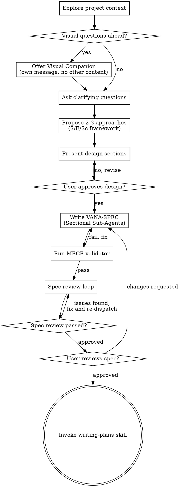

# Brainstorming Ideas Into Designs

Help turn ideas into fully formed designs and specs through natural collaborative dialogue.

Start by understanding the current project context, then ask questions one at a time to refine the idea. Once you understand what you're building, present the design and get user approval.

<HARD-GATE>
Do NOT invoke any implementation skill, write any code, scaffold any project, or take any implementation action until you have presented a design and the user has approved it. This applies to EVERY project regardless of perceived simplicity.
</HARD-GATE>

## Meta-Rules (re-injected — do NOT rely on CLAUDE.md for these)

Before ANY brainstorming action, apply these rules:

1. **MODEL AS SYSTEM:** Identify all 7 components (EP, Input, EOP, Environment, Tools, Agent, Action) for the system being designed. Never treat a task as isolated — always identify which components are in play and which are missing or misaligned.
   (Derived from: agent-system.md §5 — 7-Component System)

2. **UBS BEFORE UDS:** What blocks this system? Answer BEFORE asking what drives it. Ask: "What biases, dependencies, or environmental constraints threaten this outcome?"
   (Derived from: general-system.md §5 — Force Analysis)

3. **SUSTAINABILITY FIRST:** Risk-mitigated > efficient > scalable. A fragile fast system is worse than a slow reliable one. A sustainable 80% solution outperforms a fragile 100% solution.
   (Derived from: general-system.md §6 — S > E > Sc priority)

4. **VANA DECOMPOSE:** Every requirement = Verb + Adverb + Noun + Adjective. If you can't decompose it, you don't understand it.
   (Derived from: general-system.md §8 — ESD Phase 3)

5. **DEFINE DONE:** Every AC must be binary, deterministic, testable. "Good quality" is not an AC. "pytest passes with 0 failures" is.
   (Derived from: general-system.md §7 — Layer 3 Eval Spec)

These rules are grounded in: general-system.md §3-6, agent-system.md §3.
They are re-stated here because CLAUDE.md context may have degraded by the time this skill activates (LT-2, LT-4).

## Anti-Pattern: "This Is Too Simple To Need A Design"

Every project goes through this process. A todo list, a single-function utility, a config change — all of them. "Simple" projects are where unexamined assumptions cause the most wasted work. The design can be short (a few sentences for truly simple projects), but you MUST present it and get approval.

## Checklist

You MUST create a task for each of these items and complete them in order:

1. **Explore project context** — check files, docs, recent commits
2. **Offer visual companion** (if topic will involve visual questions) — this is its own message, not combined with a clarifying question. See the Visual Companion section below.
3. **Ask clarifying questions** — one at a time, understand purpose/constraints/success criteria
4. **Propose 2-3 approaches** — with trade-offs (use S/E/Sc framework from `references/trade-off-framework.md`) and your recommendation
5. **Present design** — in sections scaled to their complexity, get user approval after each section
6. **Write design doc** — produce extended VANA-SPEC (with §0 Force Analysis and §6 System Boundaries) using sectional sub-agent orchestration, save to `docs/superpowers/specs/YYYY-MM-DD-<topic>-design.md` and commit
7. **Spec review loop** — dispatch spec-document-reviewer subagent with precisely crafted review context (never your session history); fix issues and re-dispatch until approved (max 3 iterations, then surface to human)
8. **User reviews written spec** — ask user to review the spec file before proceeding
9. **Transition to implementation** — invoke writing-plans skill to create implementation plan

## Process Flow



**The terminal state is invoking writing-plans.** Do NOT invoke frontend-design, mcp-builder, or any other implementation skill. The ONLY skill you invoke after brainstorming is writing-plans.

## The Process

**Understanding the idea:**

- Check out the current project state first (files, docs, recent commits)
- Before asking detailed questions, assess scope: if the request describes multiple independent subsystems (e.g., "build a platform with chat, file storage, billing, and analytics"), flag this immediately. Don't spend questions refining details of a project that needs to be decomposed first.
- If the project is too large for a single spec, help the user decompose into sub-projects: what are the independent pieces, how do they relate, what order should they be built? Then brainstorm the first sub-project through the normal design flow. Each sub-project gets its own spec -> plan -> implementation cycle.
- For appropriately-scoped projects, ask questions one at a time to refine the idea
- Prefer multiple choice questions when possible, but open-ended is fine too
- Only one question per message - if a topic needs more exploration, break it into multiple questions
- Focus on understanding: purpose, constraints, success criteria
- **Apply META-RULE 2 (UBS BEFORE UDS):** Ask what blocks this system BEFORE exploring what drives it. Identify biases, dependencies, and environmental constraints early.

**Exploring approaches:**

- Propose 2-3 different approaches with trade-offs
- **Apply META-RULE 3 (SUSTAINABILITY FIRST):** Evaluate approaches using the S/E/Sc framework (see `references/trade-off-framework.md`): Sustainability > Efficiency > Scalability
- Present options conversationally with your recommendation and reasoning
- Lead with your recommended option and explain why

**Presenting the design:**

- Once you believe you understand what you're building, present the design
- **Apply META-RULE 1 (MODEL AS SYSTEM):** Identify all 7 components (EP, Input, EOP, Environment, Tools, Agent, Action) for the system being designed
- Scale each section to its complexity: a few sentences if straightforward, up to 200-300 words if nuanced
- Ask after each section whether it looks right so far
- Cover: architecture, components, data flow, error handling, testing
- Be ready to go back and clarify if something doesn't make sense

**Design for isolation and clarity:**

- Break the system into smaller units that each have one clear purpose, communicate through well-defined interfaces, and can be understood and tested independently
- For each unit, you should be able to answer: what does it do, how do you use it, and what does it depend on?
- Can someone understand what a unit does without reading its internals? Can you change the internals without breaking consumers? If not, the boundaries need work.
- Smaller, well-bounded units are also easier for you to work with - you reason better about code you can hold in context at once, and your edits are more reliable when files are focused. When a file grows large, that's often a signal that it's doing too much.

**Working in existing codebases:**

- Explore the current structure before proposing changes. Follow existing patterns.
- Where existing code has problems that affect the work (e.g., a file that's grown too large, unclear boundaries, tangled responsibilities), include targeted improvements as part of the design - the way a good developer improves code they're working in.
- Don't propose unrelated refactoring. Stay focused on what serves the current goal.

## Sectional Sub-Agent Orchestration

When writing the VANA-SPEC, decompose spec generation across 5 sub-agent groups to prevent context overload (compensates for LT-2 context compression and LT-3 reasoning degradation).

**Read `references/section-allocation.md` before dispatching sub-agents.**

### Protocol

**Step 1: Lead reads all context, produces Section Allocation Map**

The lead agent (you) reads all source material and creates a Section Allocation Map that assigns VANA-SPEC sections to 5 groups:

| Group | Sections | Focus |
|---|---|---|
| 1 (Identity) | §0 Force Analysis, §1 Identity | Strategic: forces, RACI, personas |
| 2 (Behavioral) | §2 Verb ACs | Functional: what the system does |
| 3 (Quality) | §3 Adverb ACs, §5 Adjective ACs | Quality: how well + what properties |
| 4 (Structural) | §4 Noun ACs | Structural: what components exist |
| 5 (Synthesis) | §6 Boundaries, AC-TEST-MAP, §7 Failure, §8 Boundaries, §9 Iteration, §10 Integration | Cross-cutting: boundaries, testing, integration |

**Step 2: Dispatch 5 sub-agent groups in parallel**

Each sub-agent receives:
- The Section Allocation Map (for cross-reference awareness)
- Only the source material relevant to their group
- The VANA-SPEC template sections they must fill
- Budget hint: "This task should require approximately 30K tokens of context."

**Step 3: Each sub-agent self-reviews against source material before returning**

Checkpoint: "Does every claim trace to a source page/row/col?"

**Step 4: Lead assembles all sections into complete VANA-SPEC**

Runs cross-section consistency check:
- Every AC ID referenced in §6 exists in §2-§5
- Every persona reference in §2-§5 matches §1
- Every force in §0 maps to at least one principle in §3/§5
- Traceability chain complete for every AC

**Step 5: Run MECE validator script**

```bash
./1-ALIGN/skills/ltc-brainstorming/scripts/mece-validator.sh docs/superpowers/specs/<spec-file>.md
```

- Every AC in §2-§5 appears exactly once in AC-TEST-MAP
- No duplicate AC IDs
- All source references follow format conventions
- §0 has at least 1 recursive decomposition level

### Failure Behavior

| Scenario | Action |
|---|---|
| Sub-agent failure | Retry that group (max 2 retries) |
| Assembly failure | Retry assembly with explicit error feedback |
| After 2 failed retries on any group | Escalate to Human Director with partial output + error log |
| Partial spec | Acceptable for review — missing sections flagged with `[INCOMPLETE]` tags |
| Timeout | 30 min wall-clock per group; 60 min total for assembly + validation |

## Extended VANA-SPEC Output

The OE.6.4 VANA-SPEC includes two NEW sections beyond the standard template:

### §0 Force Analysis (before §1)

**Required content:** UBS(R), UBS(A), UDS(R), UDS(A), recursive decomposition (minimum 1 level), sigmoid zone classification, bottleneck identification, synergy check.

Use the extended template at `_shared/templates/VANA_SPEC_TEMPLATE.md` for the full §0 structure.

### §6 System Boundaries (new position; old §6+ shift down)

**Required content:** Layer 1 (What Flows), Layer 2 (How It Flows Reliably), Layer 3 (How You Verify), Layer 4 (How It Fails Gracefully), Integration Chain, Feedback Loops.

Use the extended template at `_shared/templates/VANA_SPEC_TEMPLATE.md` for the full §6 structure.

**Apply META-RULE 4 (VANA DECOMPOSE) and META-RULE 5 (DEFINE DONE) throughout all AC sections.**

## After the Design

**Documentation:**

- Write the validated design (spec) to `docs/superpowers/specs/YYYY-MM-DD-<topic>-design.md`
  - (User preferences for spec location override this default)
- Use elements-of-style:writing-clearly-and-concisely skill if available
- Commit the design document to git

**Spec Review Loop:**
After writing the spec document:

1. Dispatch spec-document-reviewer subagent (see spec-document-reviewer-prompt.md)
2. If Issues Found: fix, re-dispatch, repeat until Approved
3. If loop exceeds 3 iterations, surface to human for guidance

**User Review Gate:**
After the spec review loop passes, ask the user to review the written spec before proceeding:

> "Spec written and committed to `<path>`. Please review it and let me know if you want to make any changes before we start writing out the implementation plan."

Wait for the user's response. If they request changes, make them and re-run the spec review loop. Only proceed once the user approves.

**Implementation:**

- Invoke the writing-plans skill to create a detailed implementation plan
- Do NOT invoke any other skill. writing-plans is the next step.

## Key Principles

- **One question at a time** - Don't overwhelm with multiple questions
- **Multiple choice preferred** - Easier to answer than open-ended when possible
- **YAGNI ruthlessly** - Remove unnecessary features from all designs
- **Explore alternatives** - Always propose 2-3 approaches before settling
- **Incremental validation** - Present design, get approval before moving on
- **Be flexible** - Go back and clarify when something doesn't make sense
- **S > E > Sc** - Sustainability over Efficiency over Scalability in all trade-offs
- **UBS first** - Always identify blocking forces before driving forces
- **VANA decompose** - Every requirement must decompose into Verb + Adverb + Noun + Adjective

## Visual Companion

A browser-based companion for showing mockups, diagrams, and visual options during brainstorming. Available as a tool — not a mode. Accepting the companion means it's available for questions that benefit from visual treatment; it does NOT mean every question goes through the browser.

**Offering the companion:** When you anticipate that upcoming questions will involve visual content (mockups, layouts, diagrams), offer it once for consent:
> "Some of what we're working on might be easier to explain if I can show it to you in a web browser. I can put together mockups, diagrams, comparisons, and other visuals as we go. This feature is still new and can be token-intensive. Want to try it? (Requires opening a local URL)"

**This offer MUST be its own message.** Do not combine it with clarifying questions, context summaries, or any other content. The message should contain ONLY the offer above and nothing else. Wait for the user's response before continuing. If they decline, proceed with text-only brainstorming.

**Per-question decision:** Even after the user accepts, decide FOR EACH QUESTION whether to use the browser or the terminal. The test: **would the user understand this better by seeing it than reading it?**

- **Use the browser** for content that IS visual — mockups, wireframes, layout comparisons, architecture diagrams, side-by-side visual designs
- **Use the terminal** for content that is text — requirements questions, conceptual choices, tradeoff lists, A/B/C/D text options, scope decisions

A question about a UI topic is not automatically a visual question. "What does personality mean in this context?" is a conceptual question — use the terminal. "Which wizard layout works better?" is a visual question — use the browser.

If they agree to the companion, read the detailed guide before proceeding:
`1-ALIGN/skills/ltc-brainstorming/references/visual-companion.md`
<!-- OE.6.4 fork note: path changed from original superpowers `skills/ltc-brainstorming/visual-companion.md`
     to `1-ALIGN/skills/ltc-brainstorming/references/visual-companion.md` to match the OE.6.4 directory convention. -->
